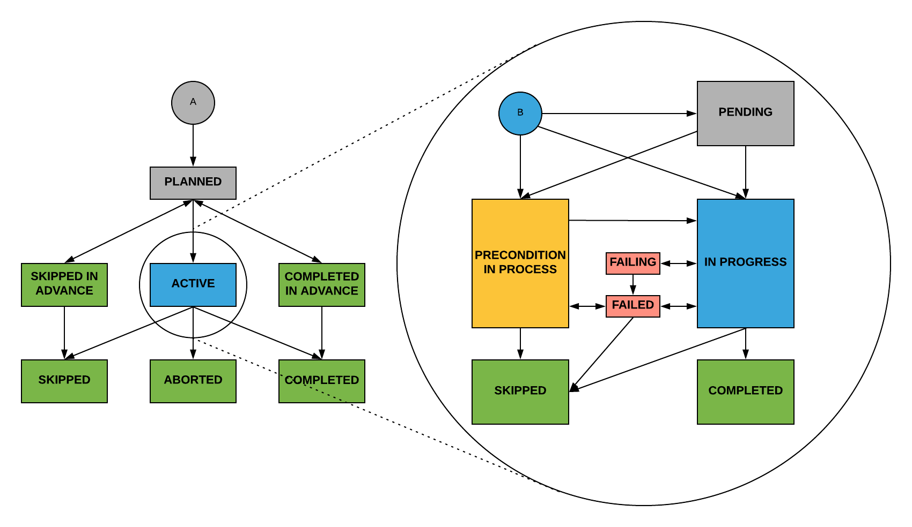

# XL Release Training Course

# Agenda

* Introduction. Introduction to XebiaLabs and XL Release
* Templates. What is a template and how to create it
* Folders. How to organize templates
* Phases. Creating phases
* Tasks. Adding and configuring tasks
* Tags & Filters. Adding metadata
* Variables. Creating and managing variable
* Releases. Instantiate and execute a release
* Release Dashboard. Review and configure release status
* Overview view. Explaining overview view
* Calendar view. Explaining calendar view
* Release Trains. Overview of release dependencies
* Integrations. Notifications, Jira, XL Deploy
* Triggers. How to define scm triggers
* Reporting. Where to find bottlenecks
* Links. Additional information

# Introduction

## Benefits

* Manage Continuous Delivery pipelines
* Gradually adopt Continuous Delivery
* Consistency and repeatability
* Easily identify inefficiencies
* Robust reporting
* Highly collaborative
* Easily integratable

## Overview

* Model and orchestrate the workflow of a release.
* Mix of manual and automated tasks (goal: increase the automation level over time).

## Transforming YOUR Release

* Customers start with XL Tools by translating existing process into XL Release
  * Benefits:
    * Repeatability
    * Auditing
    * Reporting
    * Visibility into progress, across all teams

* Customers then automate releases
  * Examples:
    * CI tool kick off XL Release when build completes
    * Auto update SNOW tickets at specific point in release
  * Benefits:
    * Consistency
    * Less manual, less error prone
    * Visibility across all tools in release process

## Core concepts

**Releases** are at the heart of XL Release

* **Templates** are used to create workflows (defined with phases and tasks)
  * A **phase** represents stages in succession
  * **Tasks** are activities in a release (automated and manual)

## Exercise: Welcome to XL Release

* Log in to XL Release, using admin/admin
* Complete the Welcome *XL Release Administrator* Release
  * You do not need to do the *Guided Tour for Release Managers*
* Complete the *Configure XL Release* Release
  * For the mail server, use the following settings
    * **Host**: localhost
    * **Port**: 1025
    * **From Address**: xlrelease@localhost
  * Check the **Mail** tab to check for emails from XL Release
  * You do **not** need to do the *Define XL Deploy Servers*
* Go to **Settings** and select the checkbox next to *Enable track changes*
* Click **Save**

# Templates

Templates are blueprints for releases. They model the process of a release flow. They describe a procedure that is used to:

* Deliver different applications
* Release a reusable application with different versions

A *release* is based on a template

## Introduction

* Template: a template is a blueprint for a release. You can use a template to start different releases that have the same flow.

## Overview

* Templates are blueprints for releases - they model the process of a release flow
* Describe a procedure that is used to:
  * Deliver different applications
  * Release a reusable application with different versions
  * A release is based on a template

## Accessing Templates

The template overview shows all templates that you have permission to see.

## Template Options

* Edit: open in the release flow editor
* New release: craete a new release from template
* Copy: create a new template that is a copy of this one
* Move: move the template to a different folder
* Delete: delete this template

## Creating a Template

* Name: name that identifies the template in the overview
* Use risk profile: 
* Description: provide more information about the template
* Duration: can set a duration for time it should take to complete template
* Run automated tasks as user: for user that runs automated tasks (needed for releases that access the XLR API)
* Abort on failure: use if you want release created from this template to be aborted whena task fails
* Tags: tags can be set

## Template Permissions

Permissions allow you to perform actions (view, edit, start) on objects (templates, tasks, releases)

Permissions for templates assigned to:

* **Teams**: grouping of users or role that have the same responsability
* **Roles** are made up of: users (both internal or external), or Global Roles ("Groups" in LDAP).

## Exercise: Templates

* Go to Design
* Go to Templates
* Click New Template
* Use the following name: *Corporate Application Release Template*
* Click Create

# Folders

## Introduction

Folders are used to:

* Organize templates and releases
* View the status of those releases
* Manage settings and tool configuration

## Overview

You can add subfolders, and delete or rename folders.

## Templates

The Templates tab shows available templates within that folder

## Releases

The Releases tab shows releases created from templates in folder

## Groups

By grouping releases together, you can manage a collection of releases as one group.

## Teams & Permissions

The Teams & Permissions tab defines the permissions for the folder and the templates and releases in it.

## Configuration

If you have the proper permissions, you can configure settings for servers, hosts, and repos you need to connect to for activities in this folder.

## Exercise: Folders

* Go to Design
* Create a new folder: *Corporate Application*
* Move your template into the folder
  * Inherit the permissions from the folder

# Phases

## Introduction

A release is divided into phases, which represent logical stages in the process that must happen in succession.

## Overview

You can create, move, delete, add, and duplicate phases

## Exercise: Phases

A release is divided into phases, which represent logical stages in the process that must happen in succession

* Create the following phases in your template:
  * **Build**
  * **Development/Test**
  * **Production**


# Tasks

## Introduction

Tasks: activities in a release are defined as tasks. In XL Release, everything that must be done is defined as a task.

## Task Types

There are several types of tasks in XL Release:

* **Human tasks**: A person performs an action and indicates when it is done
* **Automated tasks**: The XL Release execution engine performs an automated script
* **Container tasks**: Tasks that contain subtasks
* You can also create a **custom task** type

## Accessing Tasks

The task overview shows active tasks assigned to you or to a team that you are in

## Task Overview Screen Details

You can see:

* Task title
* Number of comments
* Phase of release
* Task assignee
* Flags for attention
* Filter options
* Task actions (complete, skip, fail, view in release)

## Properties

Tasks properties vary by task type

* Task title
* Description (purpose and instructions)
* Add comments or attach relevant docs
* Duration
* Scheduled start date
* Due date
* Assigned to

## Adding Tasks

* Use add task button to add tasks to a phase
* Select task type in combo box
* Drag and drop tasks to change order or parent

## Precondition

Control execution flow by setting a precondition on a task. Writing preconditions:

* Boolean expression (only started if jobStatus equals‘Success’)
  * `releaseVariables['jobStatus'] == 'Success'`
* Multi-line script (set the `result` variable). If you need a more complicated script, you must set the result variable. For example:
  * ```
    print("Executing precondition")
    ...
    result = True
    ```

## Variables

Variables can be used to manage information that:

* Is unknown (such as name or version of application)
* Is used in several places
* May change betwwen diferent releases

Variables can be:

* Global, folder or local to a template
* Created on the variable screen, or on the fly

Variables are identified by ${} syntax (can be text, password, number, list, password, etc.)

## Core Tasks

### Gate Task

A Gate task contains conditions that must be fulfilled before the release can continue. There are two types of conditions:

* simple checkboxes: here we can put 'conditions'. (Example: make sure environment is ready). When a Gate task is active, it can only be completed after all of its conditions are met, and all checkboxes have been ticked.
* dependencies. Wait for completion of
  * release, phase, task
  * variable with the id of another release

### Manual Task

A manual task represents a step in a template or release that must be completed by a person. It is the most basic type of task in XL Release. Like other task types, you can assign Manual tasks to a single user or to a release team.

Example:

We are preparing for the initial Pet Clinic release!, Make sure to create release notes with the following:

* Describe purpose of site
* Note what is useful to customers
* Track limitations
* Communicate what's in the next release

### Notification Task

The notification task type allows you to write emails that are sent automatically when a task becomes active. This is an automated task, so it will complete by itself (or fail if the email could not be sent) and XL Release will advance to the subsequent task.

### User input Task

A user input task is a manual task that allow users to provide values for release variables. These values can be used in other tasks in the release.

### Parallel and Sequential Group Tasks

The parallel group task type allows execution tasks in parallel, instead of in sequence. This groups tasks that should be executed simultaneously.

A Sequential Group is a container for tasks that are executed in sequence. It provides a way to group related tasks within a phase.

## Task Failure Handler

You can enable failure handling on any task in a phase. You can:

* Skip the task
* Execute a Jython script when the task fails its execution (view more here: https://docs.xebialabs.com/xl-release/how-to/task-failure-handler.html)

## Locking Tasks

Locked tasks can:

* Be automated - release will continue once locked task has completed
* Be manual - for release to continue, user will need to sign-off
* Ensure an audit trail

Lock tasks need to be executed before relese can continue. Lock permission must be added to user/team before they can lock or unlock tasks.

## Lifecycle



Tasks start in **planned** state. When a task becomes active:

* If a scheduled start has not passed yet, the task is *pending*
* Otherwise, if a precondition has been set it is evaluated. If it evaluates to:
  * *True*: The next state is in progress*
  * *False*: The task is skipped
* Completed state: When a task is completed without errors, the task enters the completed state
* Skip a task: You can also skip a task that was in progress or failed - tasks goes into skipped state (can be done in advance)
* Fail and abort: If a task fails or encounters an error the task goes into the failed state
* Failing state: Only applies to a parallel group task that contains subtasks. It indicates that one of the subtasks is in a failed state, but that other tasks are still running

## Exercise: Phases

Activities in a release are defined as tasks. In XL Release, everything that must be done, is a task.

Create the following tasks in the corresponding phases:

* **Build**
  * Wait for Dependencies (Core > Manual)
  * Build with Jenkins (Core > Manual)
  * User Input (Core > User Input)
  * Get Test Results (Core > Manual)
  * Evaluate Results (Core > Parallel Group)
    * Evaluate Unit Tests (Core > Manual)
    * Evaluate Code Coverage (Core > Manual)
  * Stage Approval (Core > Gate)
* **Development/Test**
  * Deploy to Development (Core > Manual)
  * Run Tests (Core > Manual)
  * Evaluate Results (Core > Manual)
  * Deploy to Test (Core > Manual)
  * Run Integration Tests (Core > Manual)
  * Stage Approval (Core > Gate)
* **Production**
  * Go/No Go Meeting (Core > Gate)
  * Deploy to Production (Core > Manual)
  * Announce Results (Core > Notification)
    * Ensure to fill out the To, Subject and Body Fields for this task

We will now save this current version of our template:

* Click on the **Show: Release Flow** Dropdown and select **Version Control**
* Click on **Save as new version**
  * **Name**: 1.0
  * **Description**: Creating the basics

